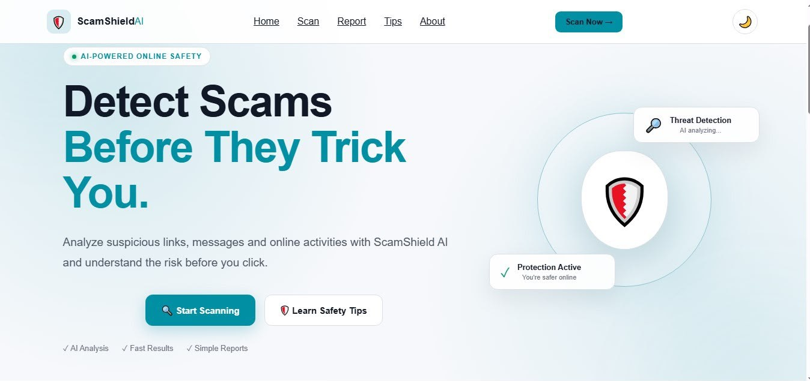
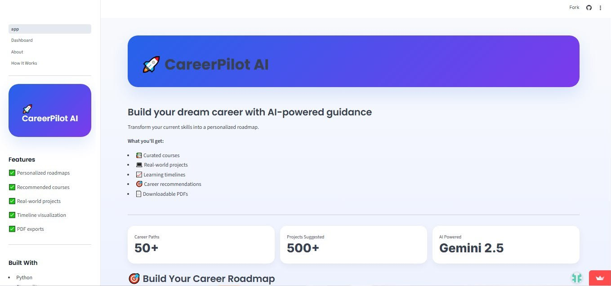
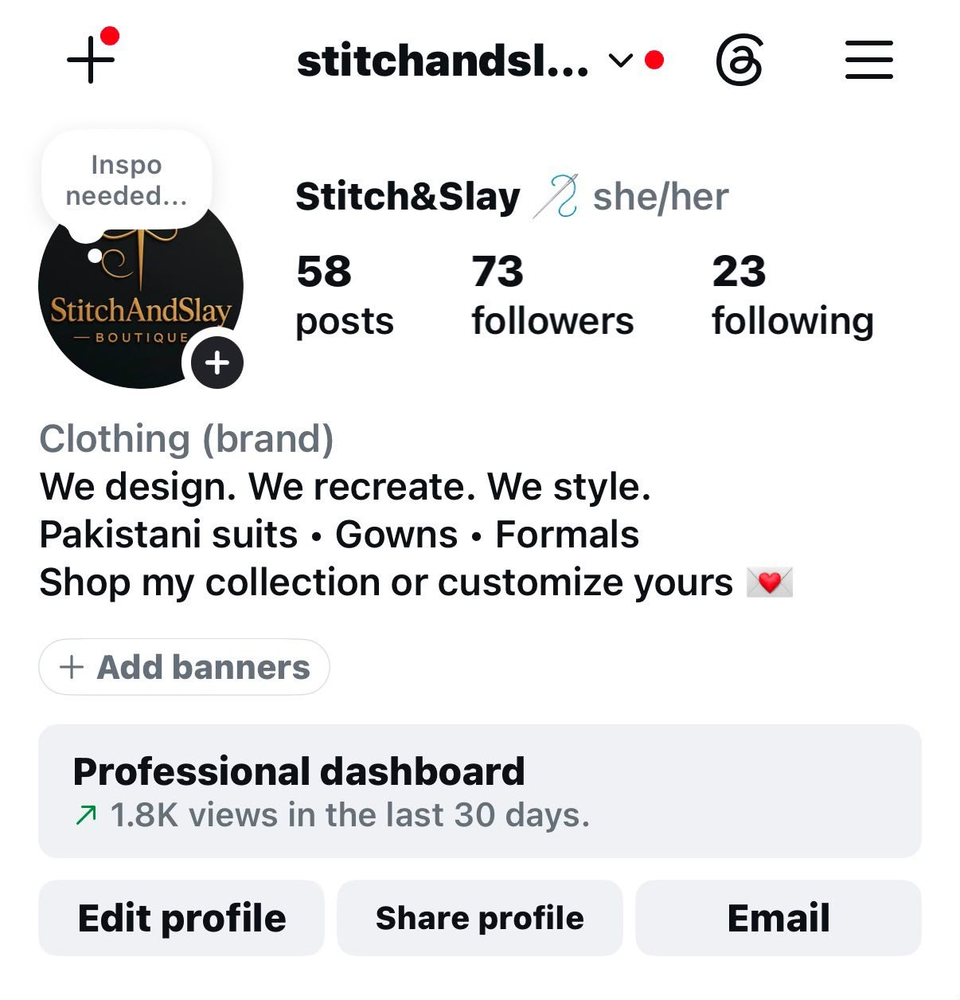
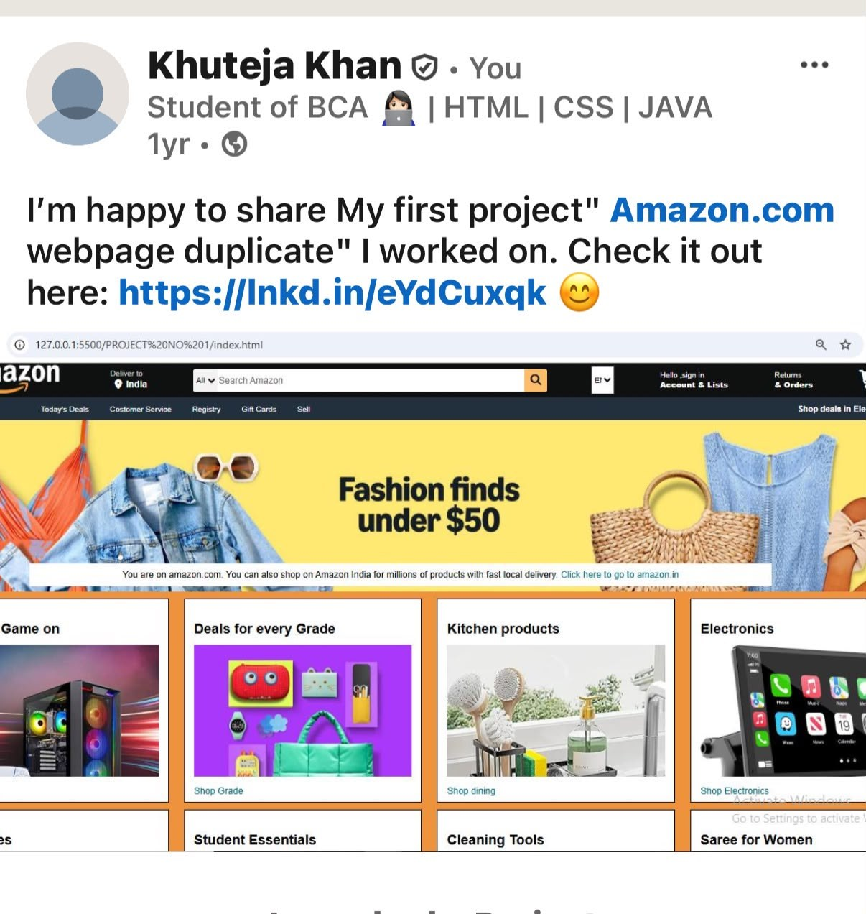
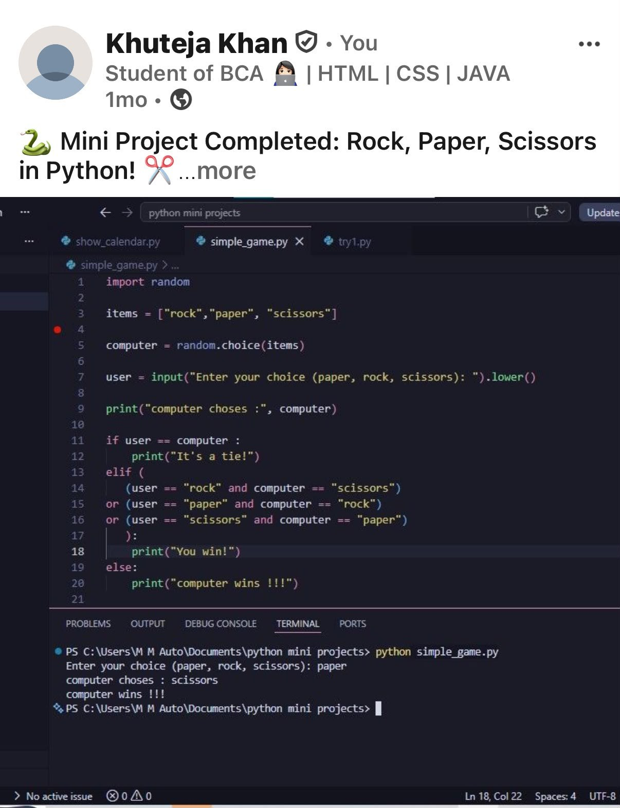

<div align="center">

# Hi, I'm Khuteja Khan 👋

### BCA Student · AI & Full-Stack Developer · Builder of Practical Products

<p>
  <a href="https://github.com/khutejakhan">
    
  </a>
  <a href="https://www.linkedin.com/in/khuteja-khan">
    
  </a>
</p>

<p>
  
  
  
  
</p>

</div>

---

## 👩‍💻 About Me

I'm a **Second Year BCA student** focused on turning ideas into practical software.

I enjoy working across **Python, AI, full-stack development and problem solving**, with a particular interest in building applications that are useful beyond the classroom.

My projects range from AI-powered platforms such as **ScamShield AI** and **CareerPilot AI**, to NLP experimentation, frontend development, and a real-world fashion brand project, **Stitch&Slay**.

> **My approach:** learn → build → document → improve.

- 🎓 Pursuing **BCA**
- 🤖 Interested in **Artificial Intelligence, Generative AI & Machine Learning**
- 💻 Building with **Python, React, FastAPI, JavaScript & Streamlit**
- 🧠 Strengthening **DSA, SQL and software engineering fundamentals**
- 🚀 Goal: grow into an **AI / Software Engineer**
- 🤝 Open to **internships, collaborations and meaningful projects**

---

## 🧰 Technical Skills

<table>
<tr>
<td valign="top" width="33%">

### Languages
- Python
- C
- C++
- JavaScript
- SQL
- HTML5
- CSS3

</td>
<td valign="top" width="33%">

### Development
- React
- FastAPI
- Streamlit
- REST APIs
- Responsive UI
- Git & GitHub
- VS Code

</td>
<td valign="top" width="33%">

### AI & Data
- Generative AI
- Google Gemini API
- NLP
- Machine Learning
- Data Structures & Algorithms
- Data analysis fundamentals
- PostgreSQL

</td>
</tr>
</table>

---

# 🚀 Featured Projects

I don't want my GitHub to be just a collection of repositories.  
These projects represent **different stages of my development journey — from programming fundamentals to AI-powered products and real-world digital work.**

---

## 🛡️ 01 · ScamShield AI
### AI-Powered Scam Detection Platform

<a href="https://github.com/khutejakhan/ScamShield-AI">
  
</a>

**ScamShield AI** is a full-stack web application designed to help users identify potentially fraudulent online content before interacting with it.

The platform accepts suspicious content such as **URLs, messages, emails and fake job offers**, sends the input through an AI-powered analysis pipeline, and returns a structured risk assessment.

### What I built
- 🛡️ AI-powered scam analysis
- 🔗 Suspicious URL detection
- 📩 SMS / email content analysis
- 💼 Fake job-offer detection
- ⚠️ Low / Medium / High risk classification
- 📊 AI confidence scoring
- 📋 Explainable risk analysis
- 🌙 Responsive interface with theme support
- 🔌 React frontend connected to a FastAPI backend

### Architecture

`React + Vite` → `FastAPI` → `Google Gemini 2.5 Flash` → `Risk Analysis` → `Structured Result`

**Stack:** `React` `Vite` `JavaScript` `CSS` `FastAPI` `Python` `Gemini API` `Uvicorn` `Vercel` `Render`

<p>
  <a href="https://github.com/khutejakhan/ScamShield-AI">
    
  </a>
  <a href="https://scam-shield-ai-git-main-khutejakhans-projects.vercel.app/">
    
  </a>
</p>

---

## 🤖 02 · CareerPilot AI
### AI-Powered Career Roadmap Generator

<a href="https://github.com/khutejakhan/CareerPilot-AI">
  
</a>

**CareerPilot AI** turns a student's current skills and target career into a structured, personalized learning roadmap.

Instead of giving generic career advice, the application combines **Generative AI, learning timelines, project recommendations and PDF generation** to create an actionable path.

### What I built
- 🧭 Personalized career roadmaps
- 📚 Course and learning-resource recommendations
- 💻 Real-world project suggestions
- 📈 Learning timeline visualization
- 📄 Downloadable career-plan PDFs
- 🔐 Environment-based API key management
- 🎨 Responsive Streamlit interface

**Stack:** `Python` `Streamlit` `Google Gemini API` `Plotly` `FPDF2` `python-dotenv`

<p>
  <a href="https://github.com/khutejakhan/CareerPilot-AI">
    
  </a>
  <a href="https://khutejakhancareerpilot-ai.streamlit.app/">
    
  </a>
</p>

---

## 📄 03 · AI Resume Analyzer
### Resume Intelligence & Career Insights

<a href="https://github.com/khutejakhan/AI-RESUME-ANALYZER">
  
</a>

**AI Resume Analyzer** is an NLP-based application that analyzes resumes, extracts relevant information and provides career-oriented insights.

The project helped me explore how unstructured resume documents can be processed and transformed into useful information.

### What I explored
- 📑 Resume parsing
- 🔎 Skill extraction
- 🧠 NLP-based analysis
- 📊 Career insights
- 🖥️ Interactive Streamlit interface

**Stack:** `Python` `Streamlit` `NLP` `spaCy` `PyPDF2` `scikit-learn`

<p>
  <a href="https://github.com/khutejakhan/AI-RESUME-ANALYZER">
    
  </a>
</p>

---

## 🧵 04 · Stitch&Slay
### A Real-World Digital Fashion Brand Project



**Stitch&Slay** is a fashion-focused digital brand where I combined creativity, branding, content creation and social media presence to build an online identity for a clothing business.

This project is intentionally included alongside my software projects because it demonstrates something different: **I can take a real-world idea, create a digital presence around it, and think about a product from both a technical and user-facing perspective.**

### What I worked on
- ✂️ Fashion brand identity and positioning
- 📱 Instagram presence and content strategy
- 👗 Showcasing Pakistani suits, gowns and formal wear
- 🎨 Visual presentation and brand consistency
- 📈 Social-media-oriented content creation
- 💡 Thinking about how a traditional business can build a digital audience

**Skills demonstrated:** `Branding` `Content Strategy` `Social Media` `Visual Design` `Product Thinking`

> **Why it belongs on a developer portfolio:** building software is not only about writing code. Understanding users, presentation, communication and real-world problems makes technical work more valuable.

---

## 🛒 05 · Amazon Clone
### Frontend Development Project



My first major frontend practice project — a recreation of an Amazon-style shopping interface using **HTML and CSS**.

The project helped me understand how large web interfaces can be broken into reusable visual sections and how CSS controls layout, spacing and presentation.

### What I implemented
- 🧭 Navigation and search layout
- 🖼️ Promotional hero section
- 🛍️ Product/category panels
- 🔗 Interactive navigation elements
- ⬆️ Back-to-top interaction
- 📱 Structured responsive-style layout
- 🎨 CSS-based visual styling

**Stack:** `HTML5` `CSS3`

<p>
  <a href="https://github.com/khutejakhan">
    
  </a>
</p>

---

## 🐍 06 · Rock Paper Scissors
### Python Programming Fundamentals



A simple command-line game built while strengthening my **Python fundamentals and problem-solving logic**.

Although small, this project represents an important stage in my learning journey: turning programming concepts into a working interactive program.

### Concepts practiced
- `random` module
- Lists
- User input
- String manipulation
- Conditional logic
- Comparison operators
- Program flow

**Stack:** `Python`

---

# 🧠 What These Projects Say About Me

| Project | What it demonstrates |
|---|---|
| 🛡️ ScamShield AI | Full-stack development + AI integration + API architecture |
| 🤖 CareerPilot AI | Generative AI + product thinking + data visualization |
| 📄 AI Resume Analyzer | NLP + Python + document processing |
| 🧵 Stitch&Slay | Branding + creativity + digital product thinking |
| 🛒 Amazon Clone | Frontend fundamentals + UI implementation |
| 🐍 Rock Paper Scissors | Programming fundamentals + logical thinking |

---

# 📈 My Current Focus

```text
Artificial Intelligence
        ↓
Generative AI & LLM Applications
        ↓
Python + Backend Development
        ↓
React + Full-Stack Engineering
        ↓
DSA + Software Engineering Fundamentals
```

I'm currently focused on becoming stronger at **building complete applications**, not just isolated pieces of code.

---

# 🌱 Currently Learning

- 🤖 Generative AI & LLM application development
- 🧠 Machine Learning fundamentals
- ⚛️ React & modern frontend development
- ⚡ FastAPI & backend architecture
- 🗄️ SQL & PostgreSQL
- 🧩 Data Structures & Algorithms
- 🔐 Cybersecurity fundamentals
- 🚀 Deployment and production-oriented development

---

# 🎯 2026 Goals

- [x] Build my first AI-powered applications
- [x] Build and deploy a full-stack AI project
- [x] Build projects using real-world use cases
- [ ] Strengthen DSA and problem solving
- [ ] Contribute to open source
- [ ] Build more production-ready applications
- [ ] Secure a software / AI internship
- [ ] Continue developing a strong technical portfolio

---

# 📊 GitHub Activity

<div align="center">


</div>

<br/>

<div align="center">


</div>

---

# 💼 What I'm Looking For

I'm interested in opportunities where I can learn from experienced developers while contributing to real products.

### Open to
- Software Development Internships
- AI / ML Internships
- Full-Stack Development Internships
- Student Developer Programs
- Open-Source Contributions
- Collaborative Projects

---

# 🤝 Let's Connect

<div align="center">

<a href="https://www.linkedin.com/in/khuteja-khan">
  
</a>

<a href="https://github.com/khutejakhan">
  
</a>

</div>

---

<div align="center">

### ✨ Build with purpose. Learn continuously. Ship better.

**Thanks for visiting my profile!**

</div>
